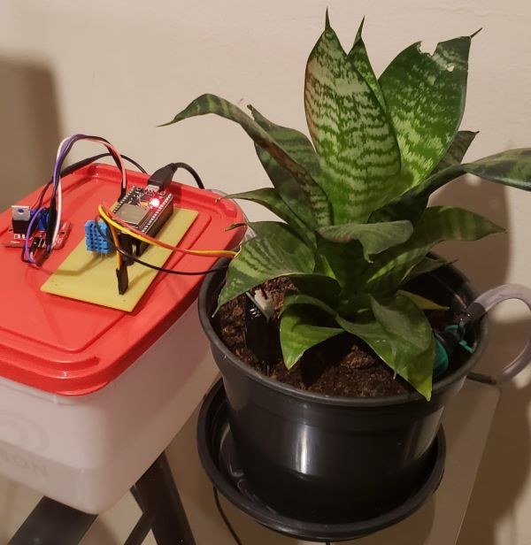
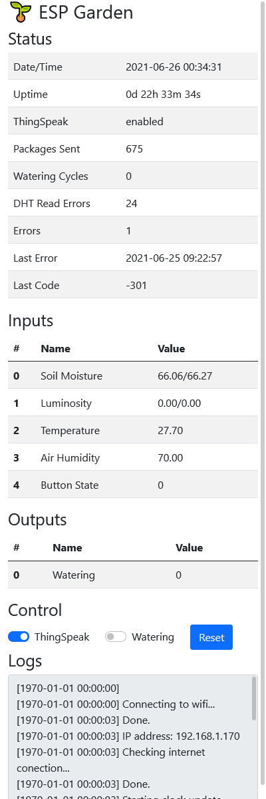

# ESP Garden

Automatic garden irrigation and monitoring system.
- Based on ESP32S
- Using PlatformIO/vscode IDE.
- Using [ThingSpeak](https://thingspeak.com) IoT platform.

## Features

- Local WebServer UI
- Cloud based logging and control
- Over-The-Air Firmware Update

## Metrics/Sensors

- Soil Moisture (Capacitive Soil Moisture Sensor v2.0)
- Luminosity (5mm LDR)
- Ambient Temperature (DHT11)
- Relative Air Humidity (DHT11)

## Live Data

[ThingSpeak Live Data](https://thingspeak.com/channels/1348790)

## Photos

### Third Generation Prototype

### Local Webserver Interface

## Useful Links

[Arduino core for the ESP32](https://github.com/espressif/arduino-esp32)

[Espressif IoT Development Framework](https://github.com/espressif/esp-idf)
