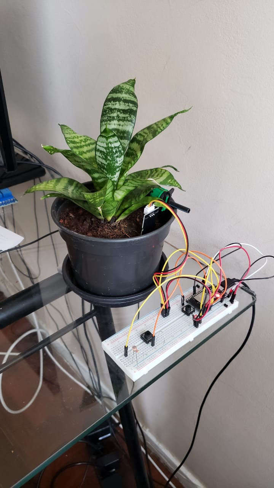

# ESP Garden

Automatic irrigation and monitoring system.
- Based on NodeMCU ESP32S
- Using PlatformIO/Arduino IDE.

## Features

- Local WebServer
- Cloud based logging

## Useful Links

[Arduino core for the ESP32](https://github.com/espressif/arduino-esp32)

[Espressif IoT Development Framework](https://github.com/espressif/esp-idf)