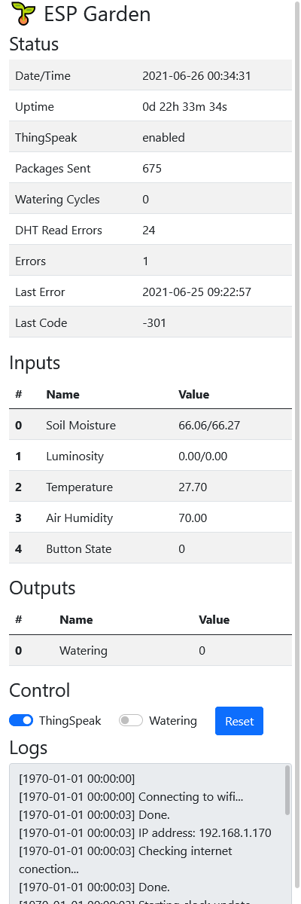

# ESP Garden

Automatic garden irrigation and environmental monitoring system based on the ESP32, built with [PlatformIO](https://platformio.org) and integrated with the [ThingSpeak](https://thingspeak.com) IoT platform.

## Features

- **Automated irrigation** — timed watering triggered locally or remotely via ThingSpeak TalkBack
- **Multi-zone relay control** — up to 4 independently timed relays, switched off by a dedicated real-time task
- **Environmental monitoring** — soil moisture (up to 3 probes), luminosity, temperature, humidity, water level, pulse flow meter and a reservoir float switch
- **Local web UI** — dashboard, configuration editor and account management, served
  from the device with no CDN dependency (jQuery is bundled)
- **Per-probe moisture classification** — Dry / Humid / Wet from a Gaussian
  naive Bayes model trained on the probe's own watering record, falling back to
  a two-point calibration and then to no badge at all
- **Scheduled watering** — up to 8 timed relay activations, edited in the web UI
- **Cloud logging** — sensor data published to ThingSpeak or ThingsBoard over MQTT (TLS)
- **On-device history** — a fixed-size ring buffer keeps the last N I/O snapshots
  across reboots, served as JSON
- **Internet watchdog** — pings Google/Cloudflare DNS and reports connectivity losses
- **NTP time sync** — clock synchronized daily via Brazilian NTP pool
- **Authenticated web UI** — nonce + SHA-256 login with OPERATOR/ADMIN roles, per-IP lockout and persistent sessions
- **Over-The-Air firmware update** — from the web UI (ADMIN only) or pushed from ThingsBoard over MQTT
- **Remote commands** — ThingsBoard RPC for relay control and status, with the same guards as the web UI

## Hardware

| Environment | Board | Sensors | Relays |
|---|---|---|---|
| `espgarden1` | NodeMCU-32S | 3× soil moisture, luminosity, DHT11 (temp + humidity), water level, flow, float switch | 4 |
| `espgarden2` | ESP32 DOIT DevKit v1 | Luminosity | 1 |
| `espgarden3` | ESP32 DOIT DevKit v1 | Soil moisture, luminosity | 1 |
| `espgarden4` | ESP32 DOIT DevKit v1 | — (base config) | 1 |
| `espgarden5` | ESP32 DOIT DevKit v1 | 2× soil moisture, luminosity, DHT11 | 4 |

### Sensors & Pinout (`espgarden5` defaults)

| Signal | Pin | Notes |
|---|---|---|
| Button | GPIO 0 | Boot button |
| Relay 1 — Watering | GPIO 19 | Active-low (`on = 0`) |
| Relay 2 | GPIO 16 | Active-low |
| Relay 3 | GPIO 17 | Active-low |
| Relay 4 | GPIO 18 | Active-low |
| DHT11 | GPIO 23 | Data line, 4.7–10 kΩ pull-up to 3V3 |
| Soil moisture 1 | GPIO 36 (`VP`, A0) | Capacitive sensor v2.0, % reported |
| Soil moisture 2 | GPIO 34 (A6) | Capacitive sensor v2.0, % reported |
| Luminosity | GPIO 39 (`VN`, A3) | 5 mm LDR in a divider with 10 kΩ to GND, % reported |
| Water level | GPIO 34 (A6) | Analog, converted via calibration curve (not on `espgarden5`) |
| Flow meter | GPIO 27 | Pulse input, interrupt-counted; `pulsesPerLitre` sets the scale (`espgarden1`) |
| Float switch | GPIO 26 | Digital, internal pull-up; `activeLevel` sets which level means "raised" (`espgarden1`) |

Two hardware rules constrain these choices:

- **Every analog input must be on ADC1 (GPIO 32–39).** ADC2 cannot be read while WiFi is associated.
- **GPIO 34–39 are input-only and have no internal pull-up** — fine for the LDR and the moisture probes, unusable for the DHT11 or a relay. Relay pins also avoid the strapping pins (0, 2, 5, 12, 15) and GPIO 6–11 (SPI flash).

Older boards keep the historical watering relay on GPIO 15; that is a strapping pin (MTDO) and new hardware should not reuse it.

`espgarden1` (NodeMCU-32S) uses: button 0 · relays **15, 16, 17, 18** ·
DHT11 23 · soil moisture **36, 35 and 32** · luminosity 39 · water level 34.
That spends five of the six ADC1 channels a WROOM-32 exposes (32–36, 39; 37 and
38 are not bonded out), leaving GPIO 33 for a fourth probe.
Its second probe is dashboard-only — field 4 is the water level there, so
publishing it needs an explicit `thingSpeak.moisture2Field`, and the firmware
refuses a number a fitted sensor already owns. GPIO 16 and 17 are
free there because the ESP32-WROOM-32 has no PSRAM — on a WROVER module they are
not. `ConfigFile::validatePins()` logs every GPIO claimed by two peripherals and
every relay parked on an input-only pin (34–39) at boot.

Pin assignments can be overridden per device in `config.json` (see below).

## Getting Started

### Prerequisites

- [VS Code](https://code.visualstudio.com) + [PlatformIO IDE extension](https://platformio.org/install/ide?install=vscode)
- Git

### Build & Flash

```bash
# Clone
git clone https://github.com/andrenepomuceno/esp-garden.git
cd esp-garden

# Build a specific environment
pio run -e espgarden1

# Upload firmware
pio run -e espgarden1 --target upload

# Upload filesystem (SPIFFS — config + web assets)
pio run -e espgarden1 --target uploadfs

# Open serial monitor
pio device monitor
```

### Configuration

Copy `data/config.template.json` to `data/config.json` and fill in the values before uploading the filesystem:

```jsonc
{
    "version": 1,
    "id": "1a2b",            // last 4 hex digits of ESP32 MAC (printed on boot)
    "hostname": "espgarden1",
    "timezone": "<-03>3",    // POSIX TZ string — adjust for your region
    "wifi": {
        "ssid": "your-wifi",
        "password": "your-password"
    },
    "ota": {
        "username": "admin",
        "password": "your-ota-password"
    },
    "thingSpeak": {
        "apiKey": "WRITE_API_KEY",
        "channel": 123456,
        "moisture2Field": 0     // field for probe 2, 0 = keep it off the channel
    },
    "talkBack": {
        "apiKey": "TALKBACK_API_KEY",
        "channel": 123456        // TalkBack queue ID
    },
    "mqtt": {
        "clientID": "your-mqtt-client-id",
        "username": "your-mqtt-username",
        "password": "your-mqtt-password",
        "server": "mqtt3.thingspeak.com",
        "port": 8883,
        "cacert": "/thingspeak.pem",
        "backend": "thingspeak",  // or "thingsboard"
        "useTLS": true,           // false for a self-hosted broker on 1883
        "rpc": true,              // accept remote commands (ThingsBoard only)
        "fwUpdate": true,         // accept firmware pushed from the broker
        "fwTitle": "esp-garden"   // only firmware with this fw_title is flashed
    },
    "log": {
        "level": 4               // 0 disable .. 4 info (default) .. 6 trace
    },
    "history": {                 // on-device ring buffer of I/O snapshots
        "records": 1440,         // file capacity; 0 disables. 1440 = 24 h at 60 s
        "periodSec": 60          // one record per this many seconds
    },
    "moisture": [                // one entry per probe
        // dry = reading in air, wet = submerged; equal values disable the
        // two-point fallback. relay = the pump that waters this probe, an
        // index into io.relays; -1 means none, and a probe with none never
        // gets a trained model.
        { "dry": 0, "wet": 0, "relay": 0 },
        { "dry": 0, "wet": 0, "relay": 1 },
        { "dry": 0, "wet": 0, "relay": 2 }
    ],
    "io": {                      // GPIO pin overrides (optional)
        "button": 0,
        "relays": [              // index 0 is the watering relay on every board
            { "pin": 19, "on": 0, "name": "Watering" },
            { "pin": 16, "on": 0, "name": "Relay 2" },
            { "pin": 17, "on": 0, "name": "Relay 3" },
            { "pin": 18, "on": 0, "name": "Relay 4" }
        ],
        "dht": 23,
        "soilMoisture": [36, 35, 32],
        "luminosity": 39,
        "waterLevel": 34,
        "flow": {                // pulse flow meter; omit the key if not fitted
            "pin": 27,
            "name": "Flow",
            "pulsesPerLitre": 450
        },
        "floatSwitch": {         // reservoir level switch; omit if not fitted
            "pin": 26,
            "name": "Float Switch",
            "activeLevel": 0,    // logic level that means "raised"
            "interlock": false,  // refuse to run a pump on an empty reservoir
            "fillRelay": 3       // the relay that refills it, exempt; -1 = none
        }
    },
    "schedules": [               // up to SCHEDULE_COUNT (8) timed activations
        {
            "name": "Morning zone 1",
            "relay": 0,          // index into io.relays
            "hour": 6,
            "minute": 30,
            "days": 127,         // bitmask, bit 0 = Sunday; 127 = every day
            "durationMs": 10000, // 1..30 000 — the same ceiling startRelay applies
            "enabled": false     // absent means false
        }
    ]
}
```

Schedules are edited at **`/schedules.html`**, not through the generic config
editor — that editor renders a top-level array of objects as a read-only text
field. A schedule fires at most once per minute per entry, is skipped while the
clock is unsynced (the device will not water on a 1970 clock), and goes through
the same `startRelay()` as every other path, so the duration ceiling and the
already-running guard apply. Changes take effect after a restart.


### What the config decides, and what the build still decides

**Which peripherals a board has is configuration, not a build flag.** The
length of `io.relays` is how many relays it drives; the length of
`io.soilMoisture` is how many probes it reads; a single-instance sensor is
fitted if and only if its key exists in `io`. Adding a probe or a relay is an
edit in **`/devices.html`** followed by a restart — no rebuild, no serial cable.

Two things are still decided at build time, and cannot be otherwise:

- **The set of KINDS.** A DHT needs the DHT driver linked in, so no web page
  can add a kind this firmware has no code for. `GET /capabilities.json` lists
  the ones it does have.
- **The per-kind maximum** — `RELAY_MAX` (8) and `MOISTURE_MAX` (4) in
  `BuildConfig.h`. `MOISTURE_MAX` is pinned to the number of moisture slots in
  the history record by a `static_assert`; raising one without the other would
  give a probe no place in stored history.

Every driver is compiled into every image. That was measured before it was
chosen: the minimal board came to 1.166 MB and the fully populated one to
1.187 MB, so the whole `HAS_*` split was buying 21 KB out of a 1.69 MB slot.

**Upgrading from a build-flag firmware:** a config written when the flags
decided everything may still carry `io` keys for sensors that used to be
compiled out — they were harmless dead weight then and mean "fitted" now.
Check the boot log, which states exactly what it decided:

```
[I] Sensors: 3 moisture, luminosity, DHT, water level, flow, float switch
```

If it lists something the board does not have, delete that key in
`/devices.html`. A phantom flow meter counts interference as flow; a phantom
float switch reads at its pull-up, which is "empty".

`io.relays` and `io.soilMoisture` also accept the pre-2.0 spelling — a scalar
`"watering"` / `"wateringOn"` pair and a scalar `"soilMoisture"` — so a config
written for a single-relay device still loads unchanged, as exactly one relay
and one probe.

The device ID is printed to the serial monitor on every boot (`ID: 1a2b`).

## Authentication

The web UI authenticates with a nonce + SHA-256 challenge — the password never
crosses the network, and the exchange cannot be replayed:

1. `GET /nonce?username=<u>` → `{nonce, salt, ttlMs}`
2. `passwordHash = sha256(salt + ":" + password)`
3. `response = sha256(nonce + ":" + passwordHash)`
4. `POST /login` with `username`, `nonce`, `response` → `{token, role}`
5. every later request sends the header `Authorization-Token: <token>`

`curl -u user:pass` does **not** work — there is no HTTP Basic path. Nonces are
one-shot and expire in 30 s, sessions idle out after 24 h, and five failed
attempts from one address return `429` for a minute.

**There is no default password in the firmware.** On first boot the device
migrates `ota.username` / `ota.password` from `config.json` into `/users.json`
as a salted SHA-256 ADMIN account, and `config.json` is never served over HTTP.
Change the password by updating `ota.*` and re-uploading the filesystem, having
first deleted `/users.json` on the device — the migration only runs for a
username that is not stored yet.

| Route | Role |
|---|---|
| `/data.json`, `/history.json`, `/moisture.json` | any signed-in user |
| `/schedules.html` | ADMIN (the page reads and writes `/config.json`) |
| `/control` | OPERATOR |
| `/config.json`, `/logs`, `/updateEnable`, `/update`, `/users.json`, `/users`, `/spiffs/*` | ADMIN |

`/logout` needs only a valid token. `/spiffs/users*`, `/spiffs/sessions*` and
`/spiffs/config*` answer 403 even to an ADMIN — the browse handler would
otherwise serve the salted password hashes, the live bearer tokens and the
plaintext WiFi and MQTT credentials.

### Changing settings without reflashing

`GET /config.json` returns the current configuration with every secret
(`wifi.password`, `ota.password`, `thingSpeak.apiKey`, `talkBack.apiKey`,
`mqtt.password`) replaced by `********`. Edit the document, send it back as the
`config` form parameter of `POST /config.json`, and any field still carrying the
mask keeps its stored value — so credentials never leave the device.

The write replaces the whole file, and the document's `id` must match the
device. Nothing re-reads the configuration at runtime: the response carries
`restartRequired: true`, and the change takes effect on the next boot
(`POST /control` with `reset=1`).

### Partition table

The firmware ships a custom 4 MB layout (`partitions/esp_garden_4mb.csv`) with
1.69 MB per OTA slot. **This cannot be delivered over OTA** — a board flashed
with the stock table needs one serial upload (`pio run -e <env> -t upload`) to
move to it.

### Reservoir interlock

`io.floatSwitch.interlock` makes `startRelay()` refuse a pump while the float
reads empty — the difference between a pump that runs dry for 30 s and one that
does not run at all. The check lives in `startRelay()`, not at the call sites,
so the web UI, TalkBack, a schedule and a ThingsBoard RPC all inherit it and
all get the same refusal back. `fillRelay` names the relay that refills the
reservoir; it is exempt, because blocking the one thing that fixes an empty
tank would deadlock the system the interlock exists to protect.

**It defaults to off, and that is not laziness.** A float that is not wired yet
sits at the internal pull-up, which reads as *empty* — switching this on by
default would stop every watering on every board that has the sensor compiled
in and not fitted. Check the reading on the dashboard first, then turn it on.
While it is blocking, `/data.json` says so in `Status.Interlock`, because a
refusal that leaves no trace is indistinguishable from a relay button that does
not work.

There is deliberately **no auto-refill**. A single float that fails in the
"empty" direction would hold the fill relay on, and the failure mode of that is
a flood rather than a dry pot.

## Soil Moisture Classification

Each capacitive probe has its own gain and offset, so Dry / Humid / Wet cannot
come from a shared threshold — nor from channel history. A month of stored data
was fitted and rejected for this: a drying trend alone explains 86 % of the
variance, so clustering it into three groups just returns two arbitrary slices
of that trend plus the near-zero readings of a disconnected probe as a third
"state".

Two mechanisms replaced it, and the device uses the first one that has earned
the right to answer:

1. **A trained model** — Gaussian naive Bayes fitted per probe from its own
   watering history. Used once it passes its gates.
2. **Two-point calibration** — the air and water anchors, split into equal
   thirds. Used while the model is still accumulating evidence.
3. **Nothing.** With neither available the probe reports no state, and the
   dashboard shows no badge rather than a made-up one.

`moistureState()` in `src/sensors.cpp` is that ladder, and everything that
displays a band goes through it: the `state` key on each `/data.json` input, the
dashboard badge, and the `moisture<N>State` telemetry key on ThingsBoard.

### Two-point calibration

1. Hold the probe **in air** (connected — a disconnected probe floats to a rail
   and that value is useless) and note the value on the dashboard. That is `dry`.
2. Submerge it to its marked line in water. That is `wet`.
3. Enter both in **`/devices.html`**, save and restart. The generic config
   editor shows `moisture` read-only — it is a top-level array of objects, and
   that editor would destroy one on save.

Until `dry` and `wet` differ this probe is uncalibrated and contributes nothing
to the ladder above. No ordering is assumed: whichever end is air, the span is
split in thirds from it.

### The trained model

What clustering could not do, the relay record can. A watering is an **event**,
and an event is a label: the soil is wettest shortly after its pump ran and
driest just before the next time it runs — the second is arithmetic rather than
an assumption, since moisture only decreases between waterings. That turns an
unsupervised problem nobody could solve on this data into a weakly supervised
one with a physical basis.

Each probe gets one Gaussian per class over a single feature, the reading
itself, and a classification is the maximum-a-posteriori class plus the winning
posterior as a confidence. Three numbers per class is the entire model, which is
why training can stream the history file one record at a time instead of holding
it in RAM, and why the parameters are something a human can read and disagree
with rather than a threshold that appeared from nowhere.

Labels come out of the I/O history buffer by time relative to each watering
edge on **that probe's own relay**:

| Label | Window |
|---|---|
| Wet | the **30 min** after a watering starts |
| Dry | the **60 min** before the next watering starts |
| Humid | everything between the two |

Where the two windows overlap — a zone watered less than 90 min apart — wet
wins. A reading only counts when a cycle can be placed around it: ahead of the
buffer's first watering nothing is humid, and after its last one only the wet
window counts. Everything else in those two tails is left out of the fit, as is
every reading from a probe the buffer holds no watering for.

**Training accumulates; it does not refit.** The history buffer holds 24 h and a
zone is watered once or twice a day, so a from-scratch daily fit would have one
or two events in it — a description of yesterday, not a model. The daily run
(the `moistureModel` task) instead multiplies the stored evidence by **0.93**
and folds the new day into it. All three sufficient statistics scale together,
so the mean and variance are unchanged and only the *confidence* in them decays:
yesterday's soil is still evidence about today's, just less of it. The resulting
**half-life is about ten days** — long enough to accumulate the events a single
day cannot supply, short enough that a probe moved to a different pot stops
being described by the old one inside a fortnight.

A run makes three passes over the buffer: one to find the watering edges, one to
fit, and one to refit while discarding every sample more than **3 σ** from the
first fit's mean for its class. The second pass is needed because the rejection
threshold is itself a function of the fit it protects; the rejection is needed
because a disconnected probe reads at a rail, which is precisely the component
BIC found when this history was clustered blind. At most 32 watering edges per
probe are tracked per run. The state is persisted to `/moisture_model.bin`, so
weeks of evidence survive reboots; a firmware whose struct layout no longer
matches discards the file and starts over rather than reinterpreting old bytes
as parameters.

### When it refuses, and why refusing is the feature

A probe gets **no band from the model at all** until every one of these holds,
and a freshly set-up probe will fail them for days:

| Gate | Threshold | Why |
|---|---|---|
| Watering events seen | ≥ **6** (cumulative, decayed with the rest) | A model fitted to one cycle describes that cycle. Six is roughly a week of once-daily watering |
| Accumulated weight, per class | ≥ **20** | At a 60 s history period one 30-minute wet window is 30 samples, so this is about two or three cycles seen |
| Fisher separation, `J = (µ_wet − µ_dry)² / (σ²_wet + σ²_dry)` | ≥ **4** | J = 4 puts the two means two pooled standard deviations apart. Below it the bands overlap enough that a badge is a coin toss wearing a posterior |
| Ordering | humid strictly between dry and wet | If humid is not between them the labels disagree with the physics that produced them, and every classification from the fit is noise |

Polarity is not assumed — `dry < humid < wet` and `dry > humid > wet` both pass,
exactly as the two-point calibration assumes nothing about which end is air.

A probe watered so often that it never dries out, or one whose relay assignment
is wrong, lands near J = 0 and stays blank. **That is the intended output, not a
degraded one.** A week with no badge means the device has not yet seen enough of
this pot to say anything; the failure it exists to prevent is already on record
here, where three confident clusters turned out to be an artefact of a drying
trend.

### Which pump feeds which probe

`moisture[i].relay` is the index into `io.relays` of the pump that waters probe
`i` — on a planter with one pump per zone, probe `i` is not necessarily fed by
relay `i`. It defaults to `i`; a value outside `-1 .. relayCount - 1` is logged
and ignored, and a default that lands past the last relay this board has is
forced to `-1` — claiming a relay that does not exist would label every reading
against an event that never fires.

**`-1` means no pump feeds this probe.** Nothing labels its readings, so it
never gets a model at all; it falls back to the two-point calibration, and
`/moisture.json` reports `no relay assigned: nothing labels this probe`.

No page edits this key yet. Set it with `POST /config.json`, or in
`data/config.json` before a filesystem upload — and **re-apply it after every
save from `/devices.html`**, which rebuilds the `moisture` array from its probe
rows carrying only `dry` and `wet`. A dropped key is not an error anywhere: the
probe silently reverts to the default "probe `i` is watered by relay `i`", and
the only symptom is a model trained against a pump that waters something else.

### Inspecting it

**`/moisture.html`** shows, per probe: each class's mean, standard deviation,
prior and accumulated weight; the separation; the live classification with its
confidence; and, when there is no classification, which gate blocked it. It also
reports what the last training run scanned — records, samples used, outliers
dropped. `GET /moisture.json` is the same data, and it carries the gate
constants themselves so the page never hardcodes a threshold the firmware might
have moved.

A blank badge with no reason is what makes a classifier impossible to debug from
outside, which is why the reason is always there.

To inspect a ThingSpeak channel's history and see what it does and does not
support:

```bash
python scripts/moisture_calibration.py --days 30
python scripts/moisture_calibration.py --days 30 --end 2023-03-08   # a past window
python scripts/moisture_calibration.py --dry 94.0 --wet 12.0        # emit bands
```

## Web Interface

| Page | Role | What it does |
|---|---|---|
| `/` (`index.html`) | any signed-in user | Sensors, relay buttons, logs |
| `/config.html` | ADMIN | Edit the configuration in tabs; secrets stay masked |
| `/users.html` | ADMIN | Add, edit and remove accounts and roles |
| `/update.html` | ADMIN | Firmware and filesystem OTA |
| `/history.html` | any signed-in user | Charts over 1 h / 6 h / 12 h / 1 d / 7 d / 30 d |
| `/devices.html` | ADMIN | Add, remove, name and re-pin the relays, the moisture probes and their calibration, and the single-instance sensors |
| `/schedules.html` | ADMIN | Timed relay activations |
| `/moisture.html` | any signed-in user | The classifier's inference and its fitted parameters |


| `/moisture.html` | any signed-in user | The moisture model per probe: class means, weights, separation, live classification, and which gate blocks a probe that reports nothing |

Two endpoint behaviours worth knowing, because neither has a button:

- **`GET /config.json?secrets=1`** (ADMIN) exports the configuration
  **unmasked**. Take this before any filesystem upload: `uploadfs` overwrites
  `/config.json`, and a backup taken through the normal masked `GET` cannot be
  restored — every credential comes back as eight asterisks and the loss only
  surfaces at the next boot, as a device that cannot join the network. The
  export is logged with the caller's IP.
- **`POST /spiffs/upload`** (ADMIN) replaces **one file** instead of rewriting
  the partition. Use it whenever only files under `data/` changed: a filesystem
  deploy wipes `/config.json`, the history ring and the moisture model along
  with the web assets, so a one-line CSS change costs the device its
  credentials, its 24 h of history and its watering-event count. Send the file
  as a multipart upload whose **filename is the destination path**, with an
  `MD5` form field; the bytes land in a temp file and are moved into place only
  once the checksum matches, so a dropped connection cannot leave half a file
  in production. `/users*`, `/sessions*` and `/config*` are refused.
- **`POST /spiffs/delete`** (ADMIN) removes one file, refusing exactly what the
  upload refuses — nothing there may delete the file that lets you undo a
  mistake made there.
- **`GET /history.json?window=<seconds>`** selects by time and decimates to fit
  `limit`, returning the `stride` it used. Without it a 24 h window is 1440
  records against a 200-record cap, so the page would silently show only the
  newest three hours. The relay mask is OR-ed across each decimation bucket
  rather than sampled — it is sticky precisely because a watering is seconds
  long, and sampling would drop seven activations in eight.

## Remote Control (TalkBack)

Send commands to the device via the ThingSpeak TalkBack queue:

| Command | Description |
|---|---|
| `watering:<ms>` | Start the watering relay for `<ms>` milliseconds (max 20 000 ms) |
| `relay:<index>:<ms>` | Start relay `<index>` (0-based) for `<ms>` milliseconds (max 20 000 ms) |

Example: `watering:5000` triggers a 5-second watering cycle; `relay:2:3000`
runs the third relay for 3 seconds.

## Telemetry backends

The broker connection is one `mqtt` block; only the topic and the payload
format change with `mqtt.backend`.

| | ThingSpeak | ThingsBoard |
|---|---|---|
| Topic | `channels/<id>/publish` | `v1/devices/me/telemetry` |
| Payload | form-encoded `field1=..&field2=..` | JSON, arbitrary keys |
| Channels | **8 fields, all taken** | unlimited |
| Auth | `mqtt.username` / `mqtt.password` | access token in `mqtt.username`, empty password |

**ThingsBoard is what unblocks the extra probes.** The ThingSpeak channel's
eight fields are spoken for, which is why soil probes 2 and 3 are dashboard-only
there; the JSON payload carries every probe, its Dry/Humid/Wet state, each relay,
the DHT error rate and the firmware version with no numbering to negotiate.

```jsonc
"mqtt": {
    "backend": "thingsboard",
    "server": "thingsboard.example.com",
    "port": 1883,
    "useTLS": false,          // TLS costs 30-45 KB of heap for the handshake
    "username": "<device access token>",
    "password": "",
    "clientID": "espgarden1"
}
```

Switching backend does not migrate history: the ThingSpeak channel keeps what it
has, and ThingsBoard starts empty.

### Remote commands over ThingsBoard (RPC)

With `mqtt.backend = "thingsboard"` and `mqtt.rpc = true`, the device answers
two-way RPC on `v1/devices/me/rpc/request/+`. Send them from the device's
**Rpc debug terminal** widget or the REST API.

| Method | Params | Answers |
|---|---|---|
| `getStatus` | — | firmware, hostname, uptime, connectivity, counters, relay array |
| `getRelays` | — | `[{index, name, on, remaining}]` |
| `startRelay` | `{"relay": 0, "seconds": 5}` or `{"relay": 0, "durationMs": 5000}` | `{ok, relay, durationMs}` |
| `startWatering` | `{"seconds": 5}` — relay 0 on every board | as above |
| `stopRelay` | `{"relay": 0}` | `{ok, relay, wasRunning}` |
| `getFirmware` | — | running version, accepted `fw_title`, update state |
| `checkFirmware` | — | re-asks the broker for the firmware shared attributes |
| `restart` | — | reboots from `loop()` shortly after answering |

Commands go through the same `startRelay()` as the web UI, so **the cloud gets
no privileged path to the pumps**: the 30 s ceiling, the range check and the
already-running guard all still apply, and a refusal comes back as
`{"ok": false, "error": "..."}` rather than silence.

### Firmware updates over ThingsBoard (FOTA)

With `mqtt.fwUpdate = true` the device subscribes to the firmware shared
attributes and downloads an assigned package over MQTT in 4 KB chunks
(`v2/fw/request/<id>/chunk/<n>`), verifies the MD5, and reboots. It reports
`fw_state` telemetry (`DOWNLOADING` → `DOWNLOADED` → `VERIFIED` → `UPDATING`,
or `FAILED` with `fw_error`), and publishes `current_fw_title` /
`current_fw_version` as client attributes on every connection — which is how
ThingsBoard learns the update landed.

Assign a package in ThingsBoard with **`Title` = `esp-garden`** (matching
`mqtt.fwTitle`), checksum algorithm **MD5**, and upload
`.pio/build/<env>/firmware.bin`. Any version different from the running one is
accepted, in either direction, so a rollback is just assigning the older package.

Four things it refuses to do:

- **Flash a package titled anything else.** One tenant holds every device an
  operator owns and assigning the wrong package is one wrong click; an image
  built for another board is a brick that needs USB to recover.
- **Start while a relay is energised.** The update ends in a reboot, and on an
  ESP32 reset every GPIO floats until `relayPinsSafeInit()` runs — which on an
  active-low relay board means the pump switches back on for the length of the
  boot. The download waits for an idle relay.
- **Share the flash with a browser upload.** Both paths drive one `Update`
  object, so `/updateEnable` answers `409` while a cloud download is running and
  the cloud download waits while a browser upload is in flight.
- **Hold the flash forever.** A stalled download re-requests its chunk five
  times and then aborts, releasing `Update` — otherwise an abandoned cloud FOTA
  would lock out the browser OTA that exists precisely to recover from one.

Progress appears in `/data.json`'s `Status` as `Cloud Update` while it runs.
Set `mqtt.fwUpdate = false` to switch the whole path off.

The filesystem image is **not** distributable this way — `handleUpdateUpload`
picks `U_SPIFFS` from the uploaded filename, and the FOTA path always writes
`U_FLASH`. Use `/update.html` for `spiffs.bin`.

## Task Schedule

Tasks marked **critical** run on a dedicated FreeRTOS task; the rest share the
cooperative pump driven from `loop()`, where one blocking handler (ping,
TalkBack, an MQTT drain) stalls every other background task for its duration.

| Task | Period | Description |
|---|---|---|
| `relays` | 50 ms — **critical** | Switch each relay off when its timer expires |
| `ledBlink` | 1 s — **critical** | Blink built-in LED (enabled on config error) |
| `io` | 1 s | Read ADC sensors and rebuild the `/data.json` payload |
| `dht` | 1 s | Read temperature and humidity from DHT11 |
| `checkInternet` | 15 s | Ping DNS servers, update connectivity state |
| `history` | `history.periodSec` | Append one I/O snapshot to the ring buffer |
| `schedules` | 20 s | Fire any schedule that is due |
| `mqtt` | 1 min | Publish averaged sensor data to the configured backend |
| `talkBack` | 1 min | Poll ThingSpeak TalkBack for remote commands |
| `clockUpdate` | 24 h | Re-sync NTP clock |
| `moistureModel` | 24 h | Decay the stored moisture evidence and fold in the day's watering cycles |
| `logBackup` | 1 h | Flush serial log to SPIFFS |
| `checkMoisture` | 4 h | Check soil moisture delta after watering |

## Dependencies

| Library | Purpose |
|---|---|
| [ESPAsyncWebServer](https://github.com/me-no-dev/ESPAsyncWebServer) | Async HTTP server |
| [CriticalTaskScheduler](https://github.com/andrenepomuceno/CriticalTaskScheduler) | Cooperative task scheduler |
| [PubSubClient](https://github.com/knolleary/pubsubclient) | MQTT client |
| [DHT sensor library](https://github.com/adafruit/DHT-sensor-library) | DHT11/22 driver |
| [ESP32Ping](https://github.com/marian-craciunescu/ESP32Ping) | ICMP ping |
| [Arduino_JSON](https://github.com/arduino-libraries/Arduino_JSON) | JSON parsing |

## Live Data

[ThingSpeak Live Data](https://thingspeak.com/channels/1348790)

## Useful Links

- [Arduino core for the ESP32](https://github.com/espressif/arduino-esp32)
- [Espressif IoT Development Framework](https://github.com/espressif/esp-idf)
- [PlatformIO Documentation](https://docs.platformio.org)
- [ThingSpeak Documentation](https://www.mathworks.com/help/thingspeak/)
