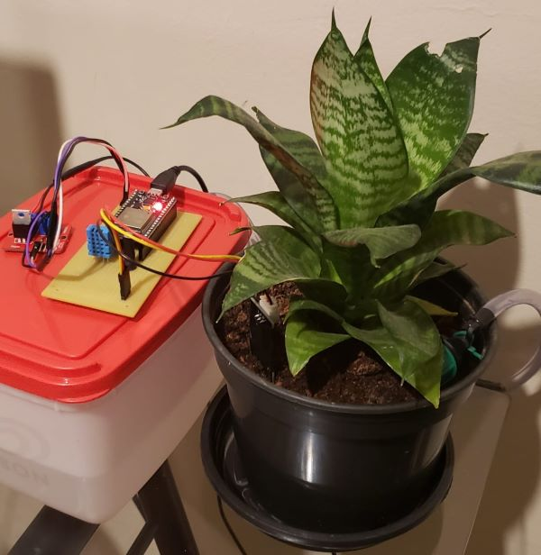

# ESP Garden

Automatic garden irrigation and environmental monitoring system based on the ESP32, built with [PlatformIO](https://platformio.org) and integrated with the [ThingSpeak](https://thingspeak.com) IoT platform.

## Features

- **Automated irrigation** — timed watering triggered locally or remotely via ThingSpeak TalkBack
- **Environmental monitoring** — soil moisture, luminosity, temperature, humidity, and water level
- **Local web UI** — real-time status dashboard served directly from the device
- **Cloud logging** — sensor data published to ThingSpeak over MQTT every 2 minutes
- **Internet watchdog** — pings Google/Cloudflare DNS and reports connectivity losses
- **NTP time sync** — clock synchronized daily via Brazilian NTP pool
- **Over-The-Air firmware update** — via the web UI (HTTP basic auth protected)

## Hardware

| Environment | Board | Sensors |
|---|---|---|
| `espgarden1` | NodeMCU-32S | Soil moisture, luminosity, DHT11 (temp + humidity) |
| `espgarden2` | ESP32 DOIT DevKit v1 | Luminosity |
| `espgarden3` | ESP32 DOIT DevKit v1 | Soil moisture, luminosity |
| `espgarden4` | ESP32 DOIT DevKit v1 | — (base config) |

### Sensors & Pinout (defaults)

| Signal | Pin | Notes |
|---|---|---|
| Button | GPIO 0 | Boot button |
| Watering relay | GPIO 15 | Active-low (`wateringOn = 0`) |
| DHT11 | GPIO 23 | Temperature & humidity |
| Soil moisture | A0 (GPIO 36) | Capacitive sensor v2.0, % reported |
| Luminosity | A3 (GPIO 39) | 5 mm LDR, % reported |
| Water level | A6 (GPIO 34) | Analog, converted via calibration curve |

Pin assignments can be overridden per device in `config.json` (see below).

## Getting Started

### Prerequisites

- [VS Code](https://code.visualstudio.com) + [PlatformIO IDE extension](https://platformio.org/install/ide?install=vscode)
- Git

### Build & Flash

```bash
# Clone
git clone https://github.com/andrenepomuceno/esp-garden.git
cd esp-garden

# Build a specific environment
pio run -e espgarden1

# Upload firmware
pio run -e espgarden1 --target upload

# Upload filesystem (SPIFFS — config + web assets)
pio run -e espgarden1 --target uploadfs

# Open serial monitor
pio device monitor
```

### Configuration

Copy `data/config.template.json` to `data/config.json` and fill in the values before uploading the filesystem:

```jsonc
{
    "version": 1,
    "id": "1a2b",            // last 4 hex digits of ESP32 MAC (printed on boot)
    "hostname": "espgarden1",
    "timezone": "<-03>3",    // POSIX TZ string — adjust for your region
    "wifi": {
        "ssid": "your-wifi",
        "password": "your-password"
    },
    "ota": {
        "username": "admin",
        "password": "your-ota-password"
    },
    "thingSpeak": {
        "apiKey": "WRITE_API_KEY",
        "channel": 123456
    },
    "talkBack": {
        "apiKey": "TALKBACK_API_KEY",
        "channel": 123456        // TalkBack queue ID
    },
    "mqtt": {
        "clientID": "your-mqtt-client-id",
        "username": "your-mqtt-username",
        "password": "your-mqtt-password",
        "server": "mqtt3.thingspeak.com",
        "port": 8883,
        "cacert": "/thingspeak.pem"
    },
    "io": {                      // GPIO pin overrides (optional)
        "button": 0,
        "watering": 15,
        "wateringOn": 0,         // logic level that activates the relay
        "dht": 23,
        "soilMoisture": 36,
        "luminosity": 39,
        "waterLevel": 34
    }
}
```

The device ID is printed to the serial monitor on every boot (`ID: 1a2b`).

## Remote Control (TalkBack)

Send commands to the device via the ThingSpeak TalkBack queue:

| Command | Description |
|---|---|
| `watering:<ms>` | Start watering for `<ms>` milliseconds (max 20 000 ms) |

Example: `watering:5000` triggers a 5-second watering cycle.

## Task Schedule

| Task | Period | Description |
|---|---|---|
| `io` | 1 s | Read ADC sensors (moisture, luminosity, water level) |
| `dht` | 10 s | Read temperature and humidity from DHT11 |
| `watering` | 100 ms | Watering state machine (pin control + timing) |
| `checkInternet` | 15 s | Ping DNS servers, update connectivity state |
| `ledBlink` | 1 s | Blink built-in LED (enabled on config error) |
| `mqtt` | 2 min | Publish averaged sensor data to ThingSpeak |
| `talkBack` | 5 min | Poll ThingSpeak TalkBack for remote commands |
| `clockUpdate` | 24 h | Re-sync NTP clock |
| `logBackup` | 1 h | Flush serial log to SPIFFS |
| `checkMoisture` | 4 h | Check soil moisture delta after watering |

## Dependencies

| Library | Purpose |
|---|---|
| [ESPAsyncWebServer](https://github.com/me-no-dev/ESPAsyncWebServer) | Async HTTP server |
| [CriticalTaskScheduler](https://github.com/andrenepomuceno/CriticalTaskScheduler) | Cooperative task scheduler |
| [PubSubClient](https://github.com/knolleary/pubsubclient) | MQTT client |
| [DHT sensor library](https://github.com/adafruit/DHT-sensor-library) | DHT11/22 driver |
| [ESP32Ping](https://github.com/marian-craciunescu/ESP32Ping) | ICMP ping |
| [Arduino_JSON](https://github.com/arduino-libraries/Arduino_JSON) | JSON parsing |

## Live Data

[ThingSpeak Live Data](https://thingspeak.com/channels/1348790)

## Photos

### Third Generation Prototype



### Local Web Interface


## Useful Links

- [Arduino core for the ESP32](https://github.com/espressif/arduino-esp32)
- [Espressif IoT Development Framework](https://github.com/espressif/esp-idf)
- [PlatformIO Documentation](https://docs.platformio.org)
- [ThingSpeak Documentation](https://www.mathworks.com/help/thingspeak/)
