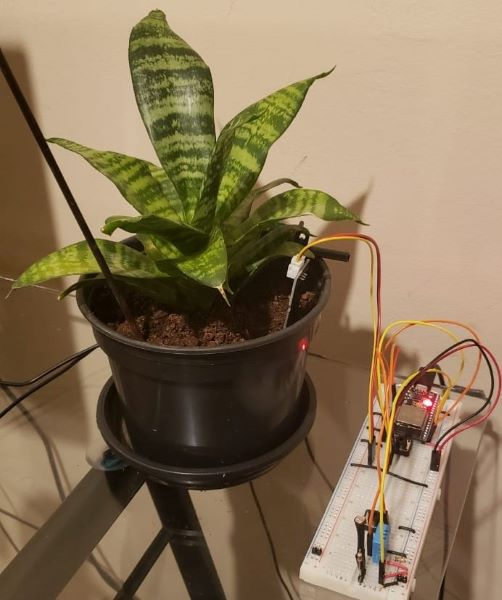

# ESP Garden

Automatic garden irrigation and monitoring system.
- Based on NodeMCU ESP32S
- Using PlatformIO/vscode IDE.
- Using [ThingSpeak](https://thingspeak.com) IoT platform.

## Features

- Local WebServer
- Cloud based logging and control

## Metrics

- Soil Moisture
- Luminosity
- Ambient Temperature
- Relative Air Humidity

## Live Data

[ThingSpeak Live Data](https://thingspeak.com/channels/1348790)

## Photos

### First Prototype

### Local Webserver Interface

## Useful Links

[Arduino core for the ESP32](https://github.com/espressif/arduino-esp32)

[Espressif IoT Development Framework](https://github.com/espressif/esp-idf)