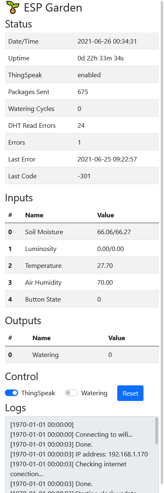

# Web interface

| Page | Role | What it does |
|---|---|---|
| `/` (`index.html`) | any signed-in user | Sensors, relay buttons, logs |
| `/config.html` | ADMIN | Edit the configuration in tabs; secrets stay masked |
| `/users.html` | ADMIN | Add, edit and remove accounts and roles |
| `/update.html` | ADMIN | Firmware and filesystem OTA |
| `/history.html` | any signed-in user | Charts over 1 h / 6 h / 12 h / 1 d / 7 d / 30 d |
| `/devices.html` | ADMIN | Add, remove, name and re-pin the relays, the moisture probes and their calibration, and the single-instance sensors |
| `/schedules.html` | ADMIN | Timed relay activations |
| `/moisture.html` | any signed-in user | The classifier's inference and its fitted parameters |


| `/moisture.html` | any signed-in user | The moisture model per probe: class means, weights, separation, live classification, and which gate blocks a probe that reports nothing |

Two endpoint behaviours worth knowing, because neither has a button:

- **`GET /config.json?secrets=1`** (ADMIN) exports the configuration
  **unmasked**. Take this before any filesystem upload: `uploadfs` overwrites
  `/config.json`, and a backup taken through the normal masked `GET` cannot be
  restored — every credential comes back as eight asterisks and the loss only
  surfaces at the next boot, as a device that cannot join the network. The
  export is logged with the caller's IP.
- **`POST /spiffs/upload`** (ADMIN) replaces **one file** instead of rewriting
  the partition. Use it whenever only files under `data/` changed: a filesystem
  deploy wipes `/config.json`, the history ring and the moisture model along
  with the web assets, so a one-line CSS change costs the device its
  credentials, its 24 h of history and its watering-event count. Send the file
  as a multipart upload whose **filename is the destination path**, with an
  `MD5` form field; the bytes land in a temp file and are moved into place only
  once the checksum matches, so a dropped connection cannot leave half a file
  in production. `/users*`, `/sessions*`, `/config*` and `/provisioned.pending`
  are refused — the last one because putting it back would re-arm the
  [first-boot setup portal](../README.md#first-boot--the-setup-portal) on a working device.
- **`POST /spiffs/delete`** (ADMIN) removes one file, refusing exactly what the
  upload refuses — nothing there may delete the file that lets you undo a
  mistake made there.
- **`GET /history.json?window=<seconds>`** selects by time and decimates to fit
  `limit`, returning the `stride` it used. Without it a 24 h window is 1440
  records against a 200-record cap, so the page would silently show only the
  newest three hours. The relay mask is OR-ed across each decimation bucket
  rather than sampled — it is sticky precisely because a watering is seconds
  long, and sampling would drop seven activations in eight.

## Web server, endpoints & OTA

`src/web.cpp`, one `AsyncWebServer` on port 80, mDNS as `<hostname>.local`.

**This whole table is the NORMAL mode's table.** A board serving the setup portal registers three other routes and none of these — see [First-boot onboarding](onboarding.md).

| Route | Method | Auth | Handler |
|---|---|---|---|
| `/`, `/index.*`, `/login.*`, `/update.*`, `/auth.js`, `/sha256.js`, `/favicon.ico` | GET | **public** | `servePublicFile()` — an explicit allow-list, no blanket `serveStatic` |
| `/nonce` | GET | **public** | issues the login challenge |
| `/device.json` | GET | **public** | the hostname, and nothing else. The login page has to name the board it is signing into and it runs before a session exists, so the answer must be public — and mDNS already broadcasts the hostname to the whole segment. The firmware version is deliberately ABSENT: a fingerprint for an unauthenticated reader, and it is on `/data.json` for anyone who logged in. Registered OUTSIDE `#if USE_CUSTOM_LOGIN`, because `/login.html` is |
| `/login`, `/logout` | POST | **public** | `CustomLogin` |
| `/data.json` | GET | session | serves the cache built by the `io` task |
| `/control` | POST | **OPERATOR** | `relay`+`relayTime`, `relay`+`relayStop` (explicit rather than a zero `relayTime`, because `String::toInt()` answers 0 for unparseable input and a malformed field must not stop a pump), `watering`, `wateringTime`, `mqtt`, `reset` |
| `/history.json` | GET | session | last N I/O snapshots, `?limit=` (cap 200), `?offset=` (logical index, oldest = 0), `?window=<sec>` (selects by time and **decimates**, reporting `stride`). An ARCHIVER must page with `offset` and never `window`, which is lossy by design |
| `/logs` | GET | **ADMIN** | the whole 8 KB log buffer as `text/plain` |
| `/config.json` | GET/POST | **ADMIN** | read with secrets masked / write the whole document. `?secrets=1` exports verbatim for a restorable backup |
| `/config.html`, `/config.js` | GET | **public** | configuration editor (the data behind it is ADMIN) |
| `/history.html`, `/history.js` | GET | **public** | charts over 1 h / 6 h / 12 h / 1 d / 7 d / 30 d |
| `/users.html`, `/users.js` | GET | **public** | account management page (data behind it is ADMIN) |
| `/schedules.html`, `/schedules.js` | GET | **public** | scheduled watering editor |
| `/moisture.html`, `/moisture.js` | GET | **public** | the classifier's inference and fitted parameters |
| `/moisture.json` | GET | session | per-probe class means, spreads, priors, separation, watering response, absorption &tau;, and which gate refused an unclassified probe |
| `/capabilities.json` | GET | session | per-kind maxima, the kinds this build has drivers for, and the usable pins — so the UI never restates a rule the firmware owns |
| `/spiffs/upload` | POST | **ADMIN** | replace ONE file instead of rewriting the partition |
| `/updateEnable`, `/update` | POST | **ADMIN** | OTA arm + upload |
| `/users.json` | GET | **ADMIN** | usernames and roles only — never the salt or hash |
| `/users` | POST | **ADMIN** | `action=upsert\|delete`, `username`, `password`, `role`. Answers `{"reauth":bool}` — true when this request signed ITSELF out |
| `/devices.html`, `/devices.js` | GET | **public** | sensor + actuator management page (data behind it is ADMIN) |
| `/spiffs/*` | GET | **ADMIN** | file browse, with `users*` / `sessions*` / `config*` shadowed 403 |
| `/spiffs/delete` | POST | **ADMIN** | remove ONE file, refusing exactly what the upload refuses |

**Auth is nonce + SHA-256, not Basic Auth** (`USE_CUSTOM_LOGIN=1`, `src/custom_login.cpp`, ported from fullbot): `GET /nonce?username=<u>` → `{nonce, salt, ttlMs}` (an unknown user gets a deterministic decoy salt derived from `config.deviceId`, so the endpoint cannot enumerate accounts) → `passwordHash = sha256hex(salt + ":" + password)` → `response = sha256hex(nonce + ":" + passwordHash)` → `POST /login` with `username`, `nonce`, `response` (+ optional `remember=true`) → `{token, role, ttlMs}`; every later request carries header **`Authorization-Token: <token>`**.

**TRAP:** `curl -u user:pass` returns 401 on every guarded route — there is no Basic-Auth path. Nonces are one-shot with a 30 s TTL; sessions idle out after 24 h; 5 failures from one IP → `429 Retry-After: 60`. `remember=true` persists the token to `/sessions.json`, so **a filesystem deploy signs everyone out**.

**A `Session` stores the user's INDEX, not the username.** `UserStore::remove()` erases from a `std::vector`, so every later entry shifts and a live session silently starts resolving to a different account — and to its role. `POST /users` with `action=delete` therefore calls `customLogin.invalidateAllSessions()` and answers `{"reauth":true}`; the page signs itself out. Any future code path that reorders the store owes the same call. **`upsert()` is not such a path** — it replaces in place or appends, so no index moves and a per-user invalidation is exact.

### One user, several devices — and the bounds that replace the old cap

Ordinary sessions were **always** multi-device: `allocateSessionSlot()` takes any free slot and has never cared who owns it. What was restricted was the REMEMBERED session — `handleLogin()` deactivated every other `active && persistent` session with the same `userIndex`, so ticking "remember me" on a phone silently un-remembered the laptop. That eviction is gone, and **`kMaxSessions` is 8, not 4**. **Removing it was not free, because that eviction was the only thing bounding remembered sessions**, and a persistent slot is exempt from the idle TTL. Eight remembered logins would have held every slot for ever, and from then on every ordinary login evicts somebody's remembered device — the OTA failure below, relocated rather than fixed. Two deliberate bounds replace it:

- **`kMaxPersistentSessions` = 6 of 8.** Two slots always remain for ordinary logins. A seventh remembered device forgets the oldest remembered one, which is explicable to an operator in a way that a refused login is not.
- **Tiered eviction in `session_slots::allocate()`**: a free slot, else the oldest NON-persistent slot, else the oldest persistent one. With the cap in force the third tier is unreachable, so **a script authenticating in a loop churns the two ephemeral slots and never touches a remembered browser**. It stays as a tier anyway, so a login can never be refused outright.
- **A 30-day absolute TTL on remembered sessions**, anchored on WALL-CLOCK seconds stored in `/sessions.json` as `"c"`. millis() cannot carry it: `loadPersistentSessions()` restamps every restored session at boot, so a millis-based expiry on a device that reboots weekly would never fire — a TTL in name only. An entry with no `"c"` (anything written by 2.11.0) is stamped at the first purge that has a synced clock, so it ages from then rather than being immortal.

The cost is one `Session` per slot plus four bytes for the stamp — **measured at +384 bytes of static RAM on `espgarden2`** (66 412 → 66 796), against ~110 KB of free heap. **More concurrent live tokens is a wider surface than before, and it is accepted deliberately**: eight bearer tokens can be valid at once where four could. What buys it back is that revocation is now explicit instead of accidental, and that a remembered token is no longer immortal. **Because the restriction was ALSO doing security work, removing it opened a hole that had to close with it.** Nothing invalidated a session when a password changed — `invalidateAllSessions()` was called from exactly one place, the user DELETE — and that was survivable only because one persistent session per user meant the next login revoked the old token as a by-product. Without the restriction, changing a compromised password would have left every stolen token alive, the precise thing the person changing it is trying to prevent. So **every path that writes a password calls `customLogin.invalidateUserSessions(index, request)`**, and there are two — `POST /users` with a non-empty `password`, and the `ota.password` push inside `POST /config.json`, which used to log *"existing sessions stay valid until logout"*. One veto at one call site is the one that gets forgotten; same rule `startRelay()` is held to.

**The caller's own session goes with the rest, and that is the deliberate choice.** Keeping it alive is the ergonomic answer and was rejected: the exemption would be granted to *whoever makes the request*, and an attacker holding a stolen ADMIN token makes that request exactly as well as the owner — so exempting the caller hands the one surviving token to the wrong party in the only scenario the invalidation exists for. The cost is one re-login with a password that was just typed. Both endpoints answer `reauth` (`/config.json` alongside `saved` and `restartRequired`), `users.js` and `config.js` sign the page out when it is true, and an ADMIN changing SOMEBODY ELSE'S password stays signed in because none of the dropped slots was theirs. A **role** change invalidates nothing, on purpose: `sessionRole()` resolves the role from the store on every request, so a demotion is already in force for live sessions.

**"`ota.password` arrived unmasked" is NOT "the password changed", and treating it as such broke the documented backup.** The restore round trip this file lists as verified is `GET /config.json?secrets=1` → edit → `POST`, and that GET returns the password in PLAINTEXT — so an ordinary restore echoes the same password back. Invalidating on that re-salts an unchanged credential, rewrites `/users.json`, and signs every admin out mid-restore with nothing altered. `handleConfigPost` now compares `hashPassword(stored.salt, incoming)` against the stored hash and does nothing when they match, which also skips two blocking LittleFS writes on the common path. **The account it acts on is the one the POSTED document names**, not a hardcoded one, and an empty `ota.username` writes nothing at all.

**Traps in the session table that were real defects first:**

- **An evicted persistent token used to come back at the next boot.** `handleLogin()` overwrites the token of whatever slot it was given, but the file was rewritten only when the NEW login was itself `remember=true`. A plain login that displaced a remembered slot therefore left the dead token in `/sessions.json`, `loadPersistentSessions()` restored it active and persistent, and `purgeExpiredSessions()` skips persistent slots — so a token the firmware had already thrown away was live for ever. The file is now rewritten whenever a remembered token is created **or destroyed**.
- **`loadPersistentSessions()` must not use `allocateSessionSlot()`.** That function EVICTS rather than failing, so a file with more entries than slots restored each one over the last and reported a count the table did not hold. It uses `session_slots::allocateFree()`, which returns `kNoSlot` instead.
- **A surplus entry is rewritten away, not merely skipped.** Left on flash it warns at every boot, and — because `invalidateUserSessions()` can only rewrite the file from the slots it loaded — a token living solely in that untouched tail would survive the password change meant to kill it.
- **The session purge may not touch flash, because it runs on EVERY guarded request.** `purgeExpiredSessions()` sits at the top of `authorizeFunction()`, on the single `async_tcp` task that also carries a 1.2 MB OTA upload, so a `savePersistentSessions()` there lands on whichever request happens to arrive first. It now only marks (`session_slots::SaveQueue`) and the **io task writes at 1 Hz** — the same shape `relaysTick()` uses to hand a bit to the io task rather than build a message under a 50 ms deadline. Any synchronous save clears the mark, because it renders a strictly newer view of the table and a deferred write must not land after a login and leave a file that predates the token just issued.

  **Deferring is safe HERE and would not be safe on the revocation paths, and that distinction is the whole argument.** Everything the purge drops is either past an ABSOLUTE TTL — so a reboot inside the one-second window restores it and the very next purge drops it again, converging — or an idempotent timestamp stamp. A token dropped by `invalidateUserSessions()` or displaced by `handleLogin()` gets no such re-check: restore it once and it lives out its natural life, which is exactly the bug `9e7b98a` fixed. **Those still write synchronously**, and that is also the reboot an operator is most likely to trigger, since `POST /config.json` answers `restartRequired`. A slot's fields are now filled with `active` false and revived on the last line, so the io task can never serialise a half-written slot into the file.
- **LRU must be computed as `now - lastSeenMs`, never by comparing the timestamps.** millis() wraps at 49.7 days, and absolute comparison then evicts the MOST recently seen session while keeping the stale ones. `session_slots.h` ranks by age for that reason, and `test_allocate_survives_the_millis_wraparound` pins it — the first version of those tests fed only increasing values and could not see the bug.

`/sessions.json` gained one optional field (`"c"`) and is otherwise unchanged, so a file written by 2.11.0 or by the 4-slot firmware still loads.

**There is no default password compiled into the firmware.** `UserStore::load()` seeds the first account by migrating `config.json`'s `ota.username` / `ota.password` into `/users.json` as ADMIN (salted SHA-256). A device whose config never loaded has no users, logs a FATAL, and the web UI is unreachable by design.

### A correction: there WAS a default password compiled into this firmware after all

The paragraph above has been in this file since the auth stack landed and it was **false in exactly one case**, which is the case the onboarding portal is about. `loadFile()` mutates as it parses and only returns `false` at the end — but it also returns EARLY on a missing, unopenable, unparseable or foreign-`id` document, and on those four paths `config.otaUser` and `config.otaPassword` are still the **constructor's** values: `"admin"` and `"password"`. `main.cpp` passed them into `UserStore::load()` regardless. So a board with no `/config.json` and no `/users.json` — the state after a filesystem deploy that dropped both, and the state a factory-blank board is in — migrated a compiled default pair into a real ADMIN account and **wrote it to flash**.

It mattered little while such a device was simply unreachable: it had no network, so nothing could reach the login page it was serving. It matters now, because that same device raises an AP with a password printed in this repository. `main.cpp` passes empty strings when the load failed, so nothing is seeded and nothing is written; the FATAL and the empty store are what the paragraph above always claimed. **Found by reading, not by a test, and nothing here has run on hardware** — `UserStore` reaches LittleFS and mbedtls, so the host suite cannot see it. The onboarding handler creates the account instead, from the credentials somebody actually typed.

**Registration order is load-bearing.** ESPAsyncWebServer matches handlers in the order added, and `AsyncURIMatcher::prefix` is a prefix match — the 403 shadows for `/spiffs/users`, `/spiffs/sessions` and `/spiffs/config` must stay *above* the `serveStatic("/spiffs", …)` line, or the credential store, the live bearer tokens and the plaintext WiFi/MQTT passwords are served to any admin session.

**A slow OTA is almost certainly SELF-INFLICTED.** The web UI pushes a 1.2 MB image in under a minute; a script here took ~7 minutes for the same image, and the difference was that script's own wait loop from a previous run, still logging in every 5 s while the upload was in flight. The board serves HTTP from a single `async_tcp` task, so anything polled during an upload competes with it — and a loop that authenticates burns session slots. `kMaxSessions` was 4 when this was first written, which is part of why it is 8; the tiering added with the persistent cap means such a loop can no longer evict a REMEMBERED browser, but it will still churn the two ephemeral slots and sign out an operator who did not tick "remember me". This file recorded the same mistake once already and it was made again. **Wait on liveness with an unauthenticated GET of a public path, authenticate once at the end, and send nothing else while an upload is running.**

**TRAP — an OTA client that times out has NOT necessarily failed.** The device writes, verifies the MD5 and reboots, and by then the connection the client was waiting on is long gone. Reading the version 30 seconds after arming reports the OLD firmware because the old firmware is still running. Both happened here and the second was misdiagnosed as a failed flash. **Confirm by polling until the version changes or the uptime resets, not by the upload's return value** — and run the upload in the background, because a 10-minute tool timeout landing mid-write is how this session already corrupted a filesystem once.

**TRAP — and a client must wait for the board to go DOWN before waiting for it to come back.** Measured 2026-09-03: upload complete 22:33:13, board down 22:33:17, serving again 22:33:19 — **the reboot takes six seconds**, and `handleUpdateRequest` answers 200 *before* `requestRestart()` reboots ~500 ms later from `loop()`. A `while not alive(): sleep(3)` loop therefore exits immediately on the OLD firmware still serving, and the check after it catches the reboot and reports "the web server never came back" on a flash that landed. It happened three times, and an intermediate diagnosis — that the board took five minutes to return — was wrong because it assumed a loop that had run to its deadline. **The wait never happened.**

**TRAP — a failed browser OTA used to reboot the board, and then poison the retry.** Three faults in one path, found while an operator got `ERR_CONNECTION_RESET` from `/update.html`:

- `handleUpdateRequest` restarted on `!Update.hasError()`, which is FALSE when `Update.begin()` was never reached. An upload that died partway therefore rebooted the device on a half-written partition, and that reset killed the next attempt's connection — five `software (ESP.restart)` boots with the firmware unchanged. It now requires `Update.isFinished()`.
- A partial write leaves `Update` RUNNING, so the next `Update.begin()` refuses because one is already in progress: a single interrupted upload poisoned every retry until a power cycle. Every failure path now calls `Update.abort()`.
- The reboot was `delay(500); ESP.restart()` inside the handler, so the browser was guaranteed to see a reset rather than "OK" — the same trap this file already records for `/control`. It now calls `requestRestart()`.

**The page no longer believes the upload's return value.** A finished flash ends in a reboot that kills the connection, so a successful update arrives at the client as an error — an operator watched `/update.html` report "Upload failed" at 100 % three times while the firmware had in fact changed. `update.js` reads the version before sending and afterwards polls `/data.json` until it changes: a different version is success, a 401 means the reboot signed the browser out (also success, said as such), and only a deadline with nothing changed is a failure. A 4xx is still shown verbatim, because that is a real refusal with a real reason. `dev_server.py` bumps its reported version on a simulated firmware upload so the page can be exercised against the mock.

OTA details: `/updateEnable` arms a module-level `g_otaEnabled` which `handleUpdateRequest` clears again, so one arm buys one upload. `handleUpdateUpload` picks `U_SPIFFS` when the uploaded *filename* is exactly `filesystem`, else `U_FLASH`; `data/update.js` renames the file to the selected radio value (`firmware` | `filesystem`) and sends an `MD5` form field computed client-side with SparkMD5.

`/data.json` shape — the contract shared by `data/index.js`, `scripts/dev_server.py` and any future frontend:

```jsonc
{ "Status":  { "Hostname": "...", "Firmware": "2.0.0", "Uptime": "...", "Internet": "online|offline", ... },
  "Inputs":  { "Soil Moisture 1": { "val": "...", "avg": "...", "var": "..." }, ... },
  "Outputs": { "Watering": "0|1", "Relay 2": "0|1", ... },      // keyed by relay NAME
  "Relays":  [ { "index": 0, "name": "Watering", "on": 0, "remaining": 0 }, ... ],
  "Channel": "1348790" }   // ABSENT when USE_THINGSPEAK is 0, which is the default
```

- The luminosity entry carries **`state`** (`clear` / `partly cloudy` / `overcast`) only while `cloud.enabled` is on AND the local time is inside the model's fitted daylight window. Absent, not empty.
- **`Status."Ambient Sensor"`** reads `SHT40` or `DHT11`, and is **absent** when neither is fitted — the same rule `state`, `fault` and `Channel` follow. `Temperature` and `Air Humidity` keep their names and their meaning across a sensor swap; their ACCURACY does not, and this row plus the `ambient_sensor` ThingsBoard attribute are what say so. `Status."Ambient Error Rate"` is the old `"DHT Error Rate"` renamed, because it is a LABEL and a board with no DHT should not claim one; the TELEMETRY key stays `dhtErrorRate`.
- **`Status.History`** reads `stored / capacity records`, or `disabled`. It gains `(config asked for N; X KB available, Y KB reserved)` only while the configured capacity did not fit — the same rule `state` and `fault` follow, where a row that explains itself on every device trains the eye to skip the one that matters. **The denominator MOVES for a while after a `history.records` change** (2.20.0): `capacity()` is the sum of the segments' own ceilings, not `segmentRecords * kSegments`, so it walks from the old value to the new one as the slots are recycled. A moving denominator is the honest rendering; the product would print `12000 / 3000` after a reduction.
- A moisture entry carries **`fault`** (`noisy`, `floating`, `railed`, `stuck`) **only when there is one**, exactly as `state` is absent rather than empty. A dashboard is read at a glance, and a column saying "connected" on every healthy probe trains the eye to skip the one case that matters. `/moisture.json` carries the evidence.
- `Inputs` and `Outputs` keys are **human-readable labels, not identifiers**. Anything that needs to *address* a relay uses the `Relays` array and its `index`. With one probe the moisture label stays `"Soil Moisture"` (no suffix) so existing dashboards keep working; with two it becomes `"Soil Moisture 1"` / `"Soil Moisture 2"`.
